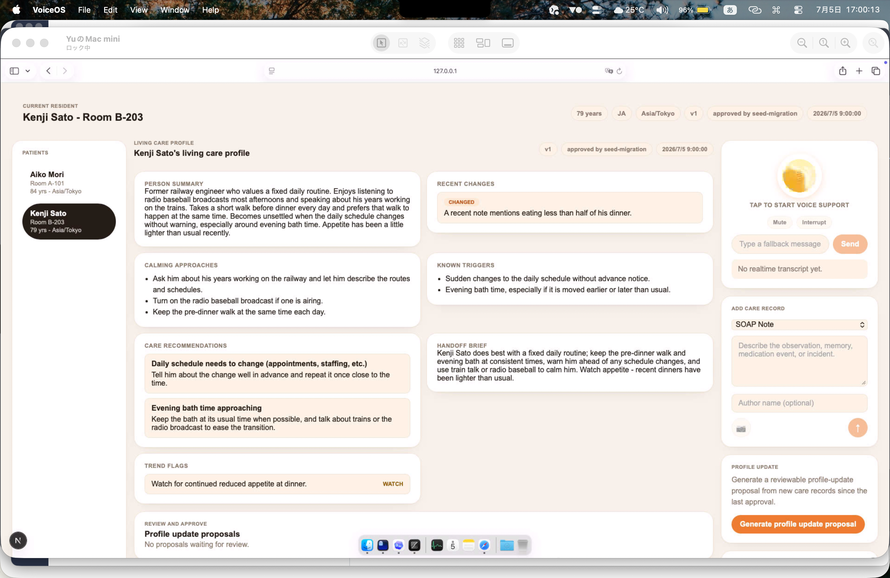
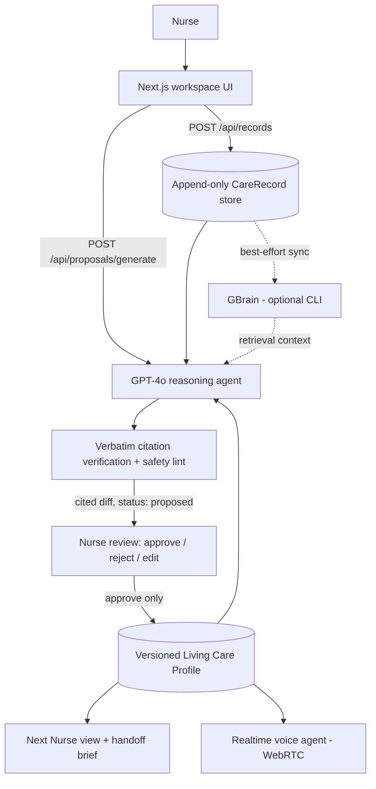

# MemoryPath

One-line pitch:
MemoryPath is a web app for dementia-care nurses that solves the "every new caregiver starts from scratch" problem — years of patient knowledge buried across hundreds of SOAP notes — by using GBrain-backed continuous learning to maintain a **Living Care Profile**: an always-current, citation-backed, nurse-approved summary of who each resident is, what changed, and what actually works for them.

It is not a chatbot. The AI prepares the work nurses already have to do (profile updates, handoff briefs, trend flags), and the nurse reviews and approves every change.



## For judges — start here

| Item | Link / Command / Notes |
|---|---|
| Live demo | Not available yet (runs locally in ~2 minutes, see quickstart) |
| Screenshot | [`docs/screenshot-workspace.png`](docs/screenshot-workspace.png) — the workspace shown above |
| Demo video | TODO |
| Local quickstart | `npm install` → create `.env.local` with `OPENAI_API_KEY=...` → `npm run dev` → open http://localhost:3000 |
| Best demo flow | Post a care record → Generate proposal → review the cited diff → Approve → watch the profile version bump (see [Demo flow](#demo-flow)) |
| GBrain usage | Optional retrieval + write-back layer via the `gbrain` CLI, env-gated by `CAREOS_MEMORY_BACKEND=gbrain`; app fully works without it (JSON fallback). See [GBrain integration](#gbrain) |
| GStack usage | Development-time only: this repo was built with Claude Code + gstack skills (incl. `setup-gbrain` to initialize the local brain). Not part of the runtime product |
| What is real | Full loop against the live OpenAI API: multi-source record ingestion → GPT-4o reasoning agent → verbatim-citation verification → nurse approve/reject/edit → versioned profile → realtime voice agent (WebRTC, verified working). 58 automated tests incl. safety-contract tests |
| What is stubbed / demo-only | JSON-file storage (no DB), no auth, 2 synthetic residents with synthetic records, camera button in the composer is a disabled placeholder, GBrain is optional (not required for the demo) |
| Key files to inspect | See table below |

Key files:

| File | Why it matters |
|---|---|
| `src/lib/profile-agent.ts` | The reasoning agent (GPT-4o, structured output): pattern extraction, change detection, "what works" learning, trend flags |
| `src/lib/proposal.ts` | Orchestration: new records + current profile + optional GBrain context → verified `ProfileUpdateProposal` (with one corrective rerun) |
| `src/lib/verify.ts` | Verbatim-citation verification — every proposed change must quote source records exactly; unsupported citations are dropped |
| `src/lib/approve.ts` | Pure approval logic: applying a proposal bumps the profile version; staleness guard rejects proposals based on outdated versions |
| `src/lib/gbrain.ts` | GBrain CLI adapter: retrieval (`gbrain search`/`think`) and record write-back (`brain/residents/records/*.md` + `gbrain import`) |
| `src/lib/schema.ts` | Zod schemas: `CareRecord` (5 source types), `LivingCareProfile` (versioned, citation-backed fields), `ProfileUpdateProposal` |
| `src/app/api/proposals/[id]/approve/route.ts` | The human-in-the-loop gate — the ONLY code path that ever changes a profile |
| `src/components/NextNurseView.tsx` | The product's face: the approved profile as a card grid with per-field evidence expanders |
| `tests/safety-contract.test.ts` | Executable safety guarantees: profile never changes without approval; fabricated citations never persist; GBrain-absent fallback |
| `data/records.json`, `data/profiles/` | Append-only record store and versioned profile store (synthetic seed data for 2 residents) |

## Problem

- **Who**: nurses and caregivers in dementia-care facilities, where staff turnover and shift rotation are constant.
- **Painful workflow today**: knowledge about a resident — what calms them, what triggers them, what changed last month — lives scattered across hundreds of chronological SOAP notes, nurse observations, medication records, and incident reports. A nurse meeting a resident for the first time either reads for hours or starts blind.
- **Why current tools are insufficient**: EHRs store notes; they don't synthesize them. Generic AI summarizers produce one-off summaries with no provenance, no accumulation over time, and no accountability — unusable in a clinical setting.
- **Why this is a good hackathon wedge**: one resident, one profile, one approval loop is enough to demonstrate the full value cycle end-to-end, while the data model (append-only records → versioned, cited projections) is the honest skeleton of a real product.

## Solution

- A nurse posts a care record (any of 5 types: SOAP note, nurse observation, family memory, medication record, incident report) → it lands in an append-only store and (optionally) syncs to GBrain → the record is permanent, citable evidence.
- The nurse clicks "Generate profile update proposal" → a GPT-4o reasoning agent compares new records against the current Living Care Profile (plus GBrain retrieval context when enabled) → it returns a per-field **diff** (before → after) where every change carries verbatim quotes from source records; fabricated quotes are stripped by server-side verification.
- The nurse reviews the diff and approves, rejects, or edits-then-approves → only approval commits a new profile version → the profile is never touched by AI alone (enforced by tests, not just policy).
- The next nurse opens the app → sees the approved profile as one screen: person summary, recent changes, calming approaches, known triggers, care recommendations, handoff brief, trend flags — each with expandable evidence → seconds instead of hours.
- The nurse can also tap the voice orb → a realtime voice agent (WebRTC, `gpt-realtime-2`) grounded on the approved profile answers questions hands-free during care.

## Demo flow

Setup: `npm install`, then `.env.local` containing `OPENAI_API_KEY=...`, then `npm run dev` and open http://localhost:3000. No other services required.

1. **Open http://localhost:3000.** Expected: the "Next Nurse" view for Aiko Mori — her approved Living Care Profile as a card grid, patient list on the left (click Kenji Sato to see per-resident isolation), intake rail on the right.
2. **Post a record.** In "Add care record", pick `Nurse Observation` and paste:
   > Evening round 19:40. Aiko was calm after her daughter Mika visited and they listened to piano music. She accepted her evening medication without hesitation after I mentioned Mika had been updated. No agitation despite corridor noise during shift change.

   Expected: the record appears at the top of "Recent care records".
3. **Click "Generate profile update proposal".** Expected: ~10–20 s of latency (live GPT-4o call), then a proposal appears in "Review and approve" with per-field before → after diffs, a rationale, and citations quoting the record you just posted. Judge checkpoint: open a citation — the quote is verbatim from the source record, because non-verbatim citations are dropped server-side (`src/lib/verify.ts`).
4. **Click Approve** (or Edit → change a field → Approve with edits). Expected: the profile header bumps to the next version, the changed cards get an "UPDATED" badge, and the handoff/trend content reflects the new evidence.
5. **Tap the voice orb** (top right; requires a microphone). Expected: status becomes "Listening"; ask "What helps when Aiko refuses medication?" — the answer is grounded in the approved profile (familiar nurse, mention Mika, quiet room), not generic advice.

Known limitations: proposal generation quality/latency depends on the live OpenAI API; voice transcription is configured for Japanese (`language: ja`); all resident data is synthetic.

## GBrain / GStack integration

### GBrain

Role: optional per-resident memory layer — retrieval context for the reasoning agent, plus a write-back audit trail. Env-gated so judges can run the demo without installing anything; enabling it changes what the reasoning agent sees, not the safety pipeline.

| Flow | What happens | File path |
|---|---|---|
| Ingestion | Bundled synthetic patient brain (`brain/residents/aiko-mori.md`) imported via `gbrain import brain` | `brain/residents/` |
| Retrieval | During proposal generation, `gbrain search` (or `think` via `GBRAIN_OPERATION=think`) is queried with resident + new-record context; output is injected into the reasoning agent's prompt as `gbrain_knowledge_context` | `src/lib/gbrain.ts`, `src/lib/proposal.ts` |
| Writeback | Every record posted through the app is written as markdown to `brain/residents/records/<id>.md` and re-imported into GBrain (best-effort, failures swallowed) | `src/lib/gbrain.ts` (`syncRecordToGBrain`) |
| Agent context | The realtime voice agent and reasoning agent are grounded on the approved profile; GBrain context supplements the reasoning agent when enabled | `src/lib/realtime.ts`, `src/lib/profile-agent.ts` |

Enable it:

```bash
bun install -g github:garrytan/gbrain
gbrain init --pglite
gbrain import brain
```

```env
CAREOS_MEMORY_BACKEND=gbrain
GBRAIN_OPERATION=search   # or think
GBRAIN_TIMEOUT_MS=30000
```

Honest note: when `CAREOS_MEMORY_BACKEND` is unset, the app runs identically on its local JSON stores — GBrain enriches retrieval, it is not load-bearing for the demo. The fallback path is covered by tests (`tests/safety-contract.test.ts`).

### GStack

GStack was used during development only — it is not part of the runtime product.

| Use case | What GStack does | File path |
|---|---|---|
| Skill / command | `setup-gbrain` skill initialized the local PGLite brain and the import workflow used above | (dev environment, no repo artifact) |
| Agent workflow | The codebase was built and reviewed with Claude Code driving phased subagents (data model → ingestion → reasoning → approval UI → hardening), each phase gated by the test suite and committed separately | commit history on `main` |
| Dev loop | Migration plan authored as a reviewable bilingual artifact before implementation | `MEMORYPATH_PLAN.html` |

## Architecture



Full write-up: [`ARCHITECTURE.md`](./ARCHITECTURE.md). Safety contract (no diagnosis/prescribing, verbatim citations required, profile never changes without nurse approval) is enforced by `tests/safety-contract.test.ts`.

## Verify it yourself

```bash
npm run test        # 58 tests: stores, proposal pipeline, approval flow, safety contract, seed data
npm run typecheck   # strict TypeScript
npm run lint
```

No secrets are committed; `.env.example` contains only a placeholder.
